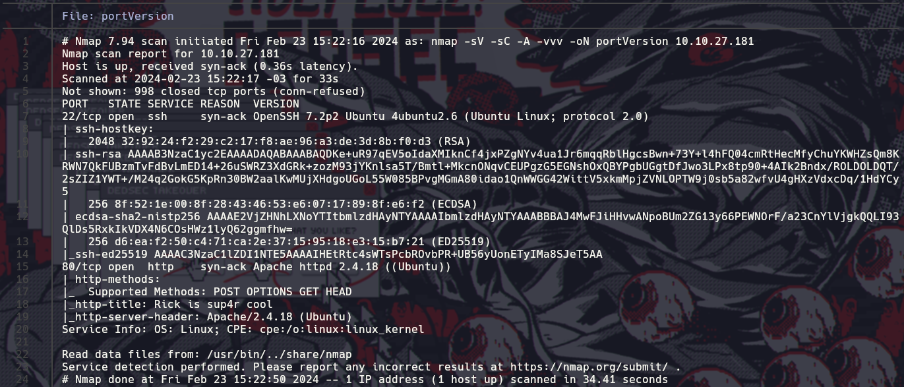

# PickleRick - Easy


# Enumeración

```bash
nmap -sV -sC -A -vvv -oN portVersion 10.10.27.181
```



Hacemos un escaneo de reconocimiento en nmap
Encontramos:
- Puerto `22/SSH` estaba abierto con una version de `OpenSSH 7.2p2` y `4ubuntu2.6`
- Contaba con servicio web ya que tenia el puerto `80/HTTP` abierto con una version de `Apache httpd 2.4.18`


esta es la pagina en si de la maquina victima


busque directorios y subdirectorios ocultos con `dirbuster` encontrando así varios interesantes como:

- “login.php”
- “/robots.txt”


este era el panel de login pero es necesario encontrar algunas credenciales


al revisar el `sourcecode` de la pagina me enconte con un comentario, que tiraba como era el nombre de usuario


en el directorio de `/robots.txt` había una pista sobre la contraseña y al intentar con el nombre de usuario dado en el anterior ítem (R1ckRul3s) me había dejado a ingresar a un command panel


al hacer un listado de los directorios que había me encontré con un archivo de texto interesante


al leerlo al parecer era el primer ingrediente


en el archivo de texto `clue.txt` me había encontrado con esta pequeña pista donde podrían estar los siguientes ingredientes de Rick


al listar la ruta `/home/Rick/` había un archivo de texto con el segundo ingrediente

# Explotación


en la raíz había una carpeta llamada /root que llamaba bastante la atención entonces intente escalar privilegios con el comando “sudo -l” para comprobar si el usuario root tenia contraseña, con eso comprobé que no tenia contraseña y predecí a revisar el directorio llamado root. Entonces ahí me encontré con el tercer y ultimo ingrediente

# Root Flag


# Conclusiones

Durante la enumeración y explotación de la máquina virtual conocida como "PickleRick", se llevaron a cabo una serie de pasos para obtener acceso completo a la máquina.

En primer lugar, se realizó un escaneo de reconocimiento utilizando nmap, a través del cual se identificó que los puertos 22/ssh y 80/http estaban abiertos. Este fue un indicativo inicial de las posibles vías de acceso a la máquina.

Luego, se utilizó una herramienta llamada dirbuster para buscar directorios y subdirectorios ocultos en el servidor web. A través de este proceso, se descubrieron varios directorios interesantes, incluyendo "login.php" y "/robots.txt".

El directorio "login.php" parecía ser un panel de inicio de sesión, pero se requerían credenciales para acceder. Para encontrar estas credenciales, se examinó el código fuente de la página web, donde se encontró un nombre de usuario.

Además, en el directorio "/robots.txt", se encontró una pista que sugiere la posible contraseña. Con la combinación de este nombre de usuario y contraseña, se logró ingresar a un panel de comandos.

En el panel de comandos, se halló un archivo de texto que contenía lo que parecía ser el "primer ingrediente". Se encontraron pistas adicionales que llevaron a la descubierta de más "ingredientes" en diferentes directorios.

Finalmente, para obtener acceso completo a la máquina, se realizó una escalada de privilegios. Esto permitió el acceso al directorio root de la máquina. En este directorio, se encontró el último "ingrediente", completando así la explotación de la máquina "PickleRick".
